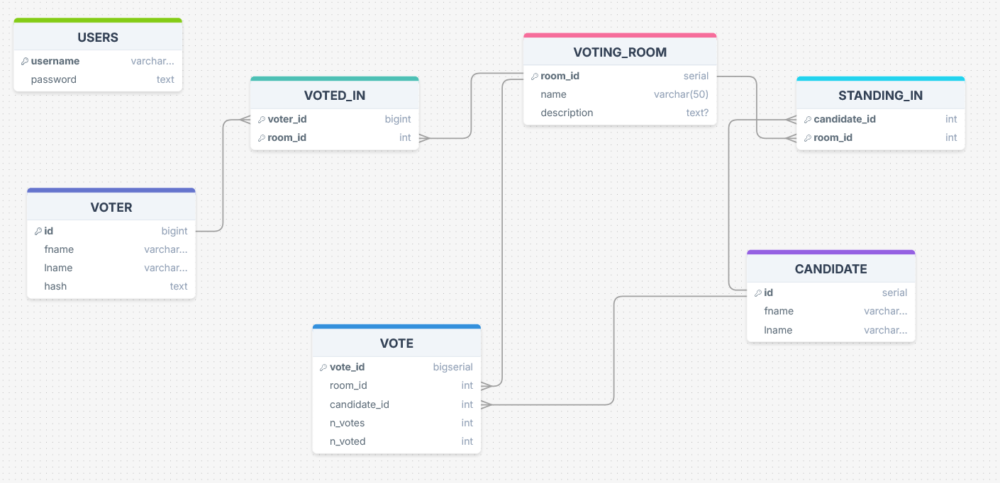

# Secure Fair Voting System 

## Overview

This is a voting system API built using Node.js, Express, PostgreSQL, and JWT authentication. The API allows users to manage voting rooms, candidates, voters, and cast votes. It also provides endpoints for user login and results retrieval.

### Key Features:
- **JWT Authentication**: Secure endpoints for managing voting rooms, candidates, and voters to allow only authorized access.
- **Voter Authentication**: Voters details and ids are cross-verified to ensure only valid voters can cast votes.
- **Voting Functionality**: Voters can cast their votes, which are validated and securely stored.
- **Voting Decay**: A weighted voting system with a decay factor to prevent strategic voting.
- **Vote Results**: Fetches weighted voting results based on the number of votes and a decay factor.
- **Anonymity**: Voters are anonymous, and their votes are securely stored without revealing their identity.
- **Encrypted Passwords**: Passwords are securely hashed using bcrypt for user authentication.

## Voting Decay Explanation

In this system, a **voting decay** mechanism is implemented to reduce the risk of strategic voting and ensure a fairer distribution of votes. The decay factor adjusts the weight of votes as more candidates are voted for. This prevents voters from unfairly amplifying the influence of their vote by strategically casting a high number of votes across many candidates.

### How Decay Works:

1. **Decay Factor**:
   - A **decay factor** is applied to each vote. In this implementation, the decay factor is set at `0.1`. This means that the weight of a vote decreases as more candidates are voted for, in order to avoid unfair advantage for voters who vote for multiple candidates.

2. **Vote Weight Calculation**:
   - The formula used for weighting is:
     ```text
     weight = 1 - (total_candidates - n_voted + 1) * decay
     ```
   - Here:
     - `n_voted` is the number of candidates voted for.
     - `total_candidates` is the total number of candidates running in the voting room.
     - `decay` is the decay factor, which reduces the weight of votes as `n_voted` increases.

3. **Vote Counting**:
   - Each vote’s weight is multiplied by the decay factor and added to the total vote count for the candidate. This ensures that votes for multiple candidates are less powerful than votes concentrated on fewer candidates, reducing the potential for strategic voting.
   
### Reducing the Risk of Strategic Voting:

The voting decay system discourages strategic voting by penalizing voters who try to distribute their votes among too many candidates. If a voter gives multiple candidates a high number of votes, the weight of those votes diminishes. This means voters are incentivized to cast votes only for candidates they truly support, rather than gaming the system by spreading votes thinly across many candidates.

### Example:
- In a voting room with 5 candidates, if a voter votes for 3 candidates, each of their votes would be weighted slightly lower compared to a voter who votes for only 1 or 2 candidates. The more candidates they vote for, the less impactful their individual votes become due to the decay factor.

This system ensures that **voters are encouraged to vote honestly**, and it mitigates the risk of **strategic voting** where voters might otherwise try to manipulate results by voting for many candidates or ranking them strategically.
  
## API Endpoints

### Public Endpoints
1. Login
2. Cast Vote
3. Get Results

### Protected Endpoints (JWT Authentication Required)
1. Create Voting Room
2. Add Candidates
3. Add Voters

API Documentation is available in the [wiki](https://github.com/DharunThota/secure-fair-voting-system/wiki).

## Database Structure

The following tables are used in this voting system:

1. **`USERS`**: Stores admin users with hashed passwords.
2. **`VOTING_ROOM`**: Stores voting rooms.
3. **`CANDIDATE`**: Stores candidates.
4. **`STANDING_IN`**: Links candidates to voting rooms.
5. **`VOTER`**: Stores voters with hashed credentials.
6. **`VOTE`**: Stores votes for candidates in specific rooms.
7. **`VOTED_IN`**: Tracks which voters have voted in which rooms.

The database schema is available in the file [schema.sql](https://github.com/DharunThota/secure-fair-voting-system/blob/main/schema.sql).




## Security

- **JWT Token**: Admin-related actions are protected by JWT tokens. Tokens expire after 1 hour.
- **Bcrypt Hashing**: Voter and admin passwords are securely hashed using bcryptjs.
  
## Setup Instructions

1. Clone the repository.
2. Install dependencies:
    ```bash
    npm install
    ```
3. Set up environment variables (`.env`):
    ```
    DB_USER=your_database_user
    DB_PASSWORD=your_database_password
    DB_DATABASE=your_database_name
    DB_HOST=your_database_host
    DB_PORT=your_database_port
    JWT_SECRET=your_secret_key
    ```
4. Start the server:
    ```bash
    npm start
    ```
5. Test the API using test.js: 
    ```bash
    node test.js
    ```

The server will run on port `3000`.
